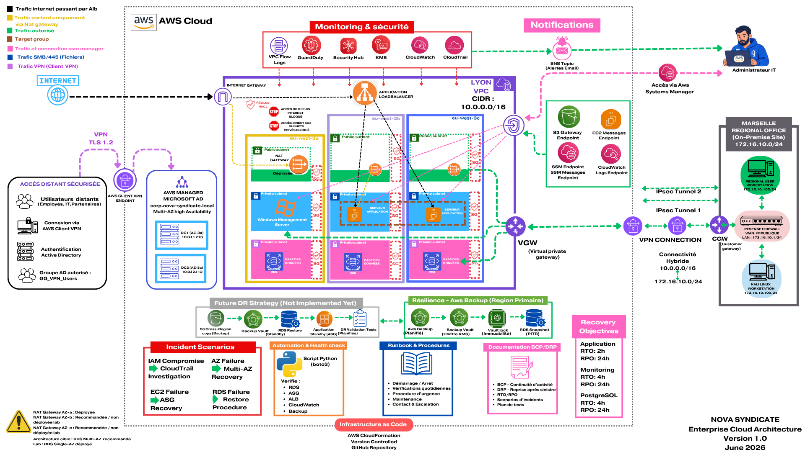
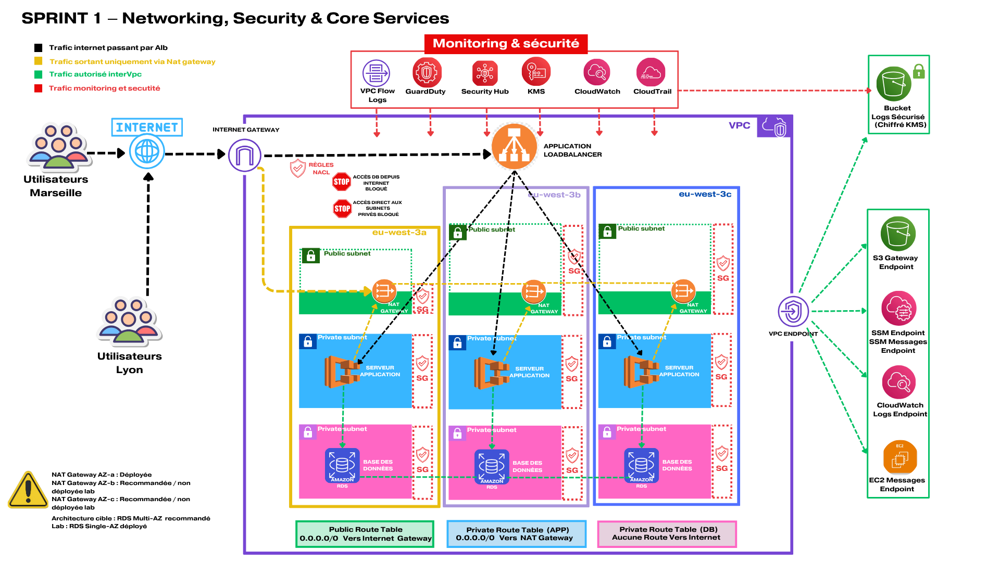
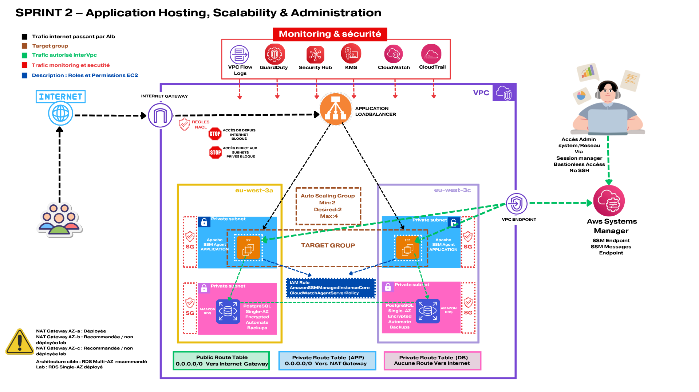
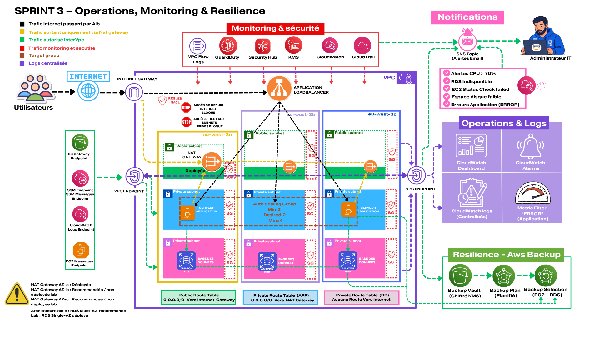
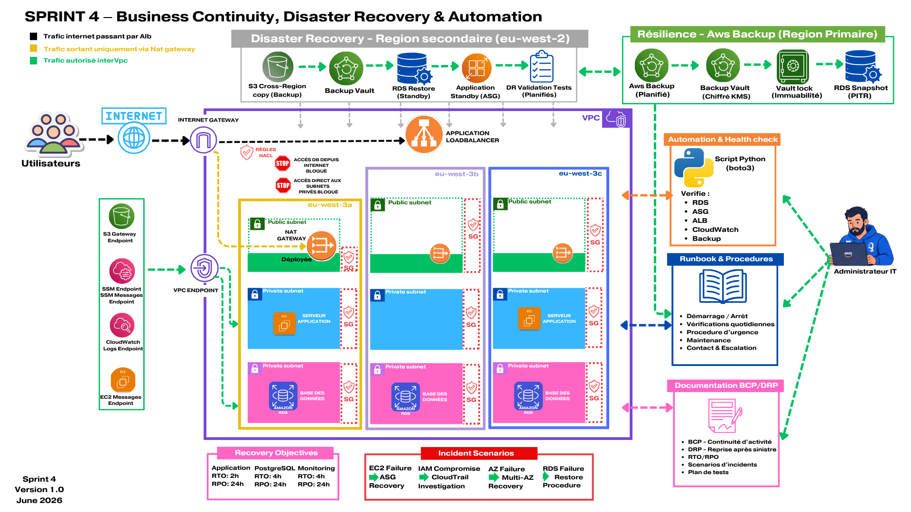
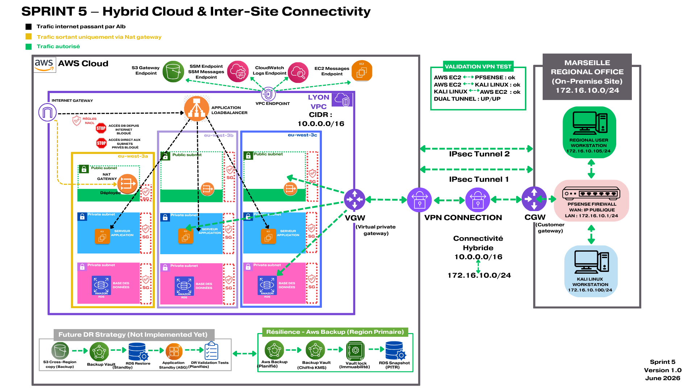
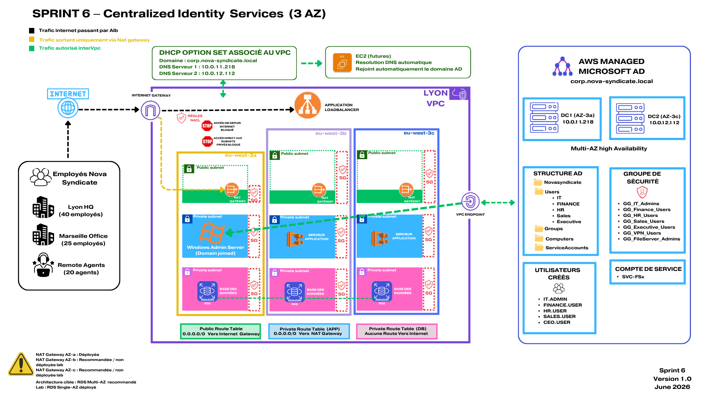
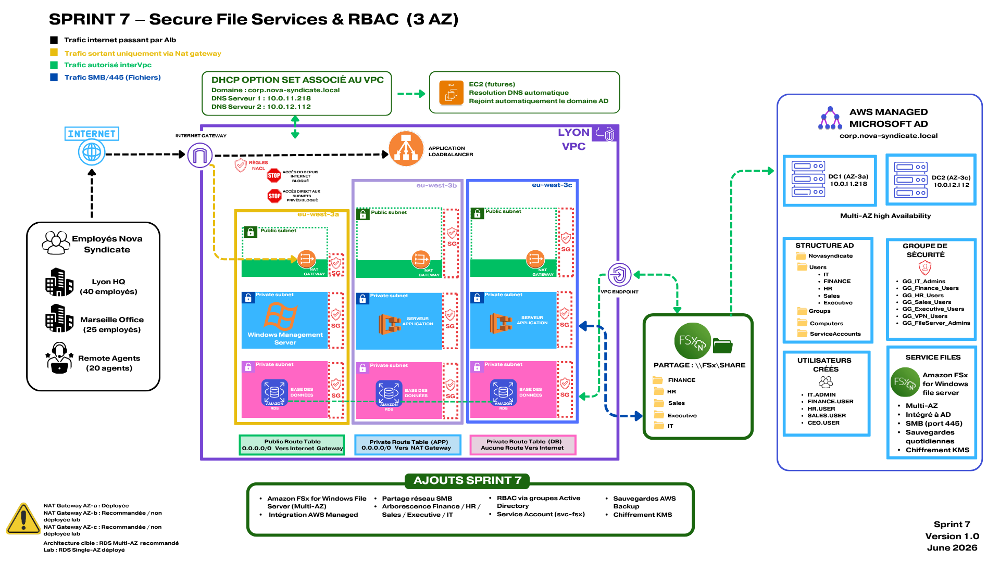
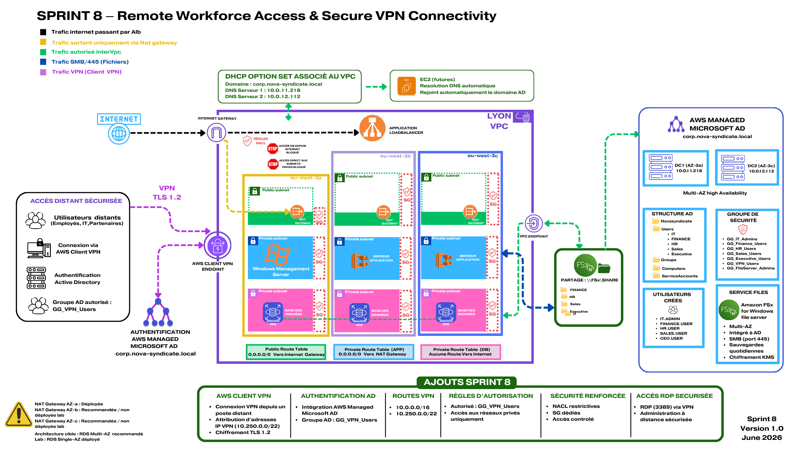

# Nova Syndicate – AWS Cloud Security & Infrastructure Modernization

## Project Overview

Nova Syndicate is a fictional logistics company specializing in the distribution of critical components for the medical, aerospace, and defense industries.

This project simulates a real-world cloud modernization engagement where a legacy infrastructure is redesigned using AWS best practices for security, scalability, resilience, automation, operational excellence, and hybrid-cloud connectivity.

The objective is to transform a fragmented on-premises environment into a secure, highly available, operationally mature, and enterprise-ready AWS platform.

---



---
## Business Context

Nova Syndicate operates from:

- Headquarters: Lyon, France
- Regional Office: Marseille, France
- 20 Remote Employees

### Challenges

- No centralized identity management
- No monitoring platform
- No backup strategy
- No disaster recovery procedures
- Limited operational visibility
- Manual administration processes
- No secure inter-site connectivity
- No hybrid-cloud integration

### Objectives

- Centralize identity and access management
- Improve security posture
- Increase scalability and availability
- Implement monitoring and logging
- Establish business continuity and disaster recovery procedures
- Automate operational tasks
- Enable secure multi-site communications
- Build a hybrid-cloud architecture

---

# Sprint Progress

| Sprint | Status |
|----------|----------|
| Sprint 1 – Secure Cloud Foundation | ✅ Completed |
| Sprint 2 – Compute & Database Platform | ✅ Completed |
| Sprint 3 – Operations, Monitoring & Resilience | ✅ Completed |
| Sprint 4 – Business Continuity, Disaster Recovery & Automation | ✅ Completed |
| Sprint 5A – Lyon ↔ Marseille Connectivity | ✅ Completed |
| Sprint 5B – AWS Site-to-Site VPN | ✅ Completed |
| Sprint 6 – Centralized Identity Services | ✅ Completed |
| Sprint 7 – Secure File Services | ✅ Completed |
| Sprint 8 – Remote Workforce Access & Secure VPN Connectivity | ✅ Completed |
| Sprint 9 – DevSecOps & Infrastructure Automation | 🔜 Next |
| Sprint 10 – Security Operations Center | ⏳ Planned |
| Sprint 11 – Cost Optimization & FinOps | ⏳ Planned |
| Sprint 12 – Executive Architecture Package | ⏳ Planned |

---

# Sprint 1 – Secure Cloud Foundation



## Objectives

Build a secure and scalable AWS foundation.

## Deliverables

- Multi-AZ VPC Architecture
- Public and Private Subnets
- Route Tables
- Security Groups
- IAM Foundations
- AWS KMS Encryption
- CloudTrail Logging
- AWS GuardDuty
- AWS Security Hub
- VPC Endpoints

## AWS Services

- Amazon VPC
- IAM
- KMS
- CloudTrail
- GuardDuty
- Security Hub
- VPC Endpoints

---

# Sprint 2 – Compute & Database Platform



## Objectives

Deploy a highly available application and database platform.

## Deliverables

- Launch Template
- Auto Scaling Group
- Application Load Balancer
- Private EC2 Instances
- PostgreSQL RDS
- CloudWatch Alarms
- Systems Manager Administration

## AWS Services

- EC2
- Auto Scaling
- Application Load Balancer
- RDS PostgreSQL
- Systems Manager
- CloudWatch

---

# Sprint 3 – Operations, Monitoring & Resilience



## Objectives

Improve observability, backup management, and operational resilience.

## Deliverables

- AWS Backup
- Backup Vault
- Backup Plan
- Backup Selection
- CloudWatch Dashboard
- Centralized Logging
- Enhanced Monitoring
- SNS Notifications

## AWS Services

- AWS Backup
- CloudWatch Dashboard
- CloudWatch Logs
- SNS
- CloudTrail

---

# Sprint 4 – Business Continuity, Disaster Recovery & Automation



## Objectives

Strengthen operational resilience through business continuity planning, disaster recovery procedures, automation, and operational documentation.

## Deliverables

### Business Continuity Plan (BCP)

- EC2 Failure Recovery
- Availability Zone Failure Recovery
- IAM Compromise Procedures
- Database Service Degradation Procedures

### Disaster Recovery Plan (DRP)

- RTO / RPO Definition
- Database Restore Procedures
- Backup Recovery Procedures
- Regional Disaster Strategy

### Automation

Python health-check script using boto3:

```bash
NOVA SYNDICATE HEALTH CHECK

RDS: OK
ASG: OK
ALB: OK
CloudWatch: OK
Backup: OK

GLOBAL STATUS: HEALTHY
```

### Operational Documentation

- Operational Runbook
- Startup Procedures
- Shutdown Procedures
- Daily Operational Checks
- Incident Response Procedures

## AWS Services

- AWS Backup
- CloudWatch
- CloudTrail
- GuardDuty
- Security Hub
- Systems Manager
- IAM
- RDS PostgreSQL

---

# Sprint 5 – Hybrid Multi-Site Connectivity

## Objectives

Extend Nova Syndicate beyond a single AWS environment and implement secure hybrid connectivity between multiple sites and an on-premises network.

The goal of this sprint was to simulate a realistic enterprise infrastructure where headquarters, regional offices, cloud resources, and on-premises systems can securely communicate.

---

# Sprint 5A – Lyon ↔ Marseille Connectivity

To represent Nova Syndicate's regional office, a second AWS environment was deployed in Marseille.

### Lyon Site

```text
CIDR: 10.0.0.0/16
```

### Marseille Site

```text
CIDR: 10.20.0.0/16
```

### Connectivity

```text
Lyon VPC
⇄
AWS VPC Peering
⇄
Marseille VPC
```

## Deliverables

- Marseille VPC
- Private Subnet
- Route Table
- Test EC2 Instance
- VPC Peering Connection
- Inter-VPC Routing

## Validation Tests

### Route Validation

```text
10.0.0.0/16
⇄
10.20.0.0/16
```

### Connectivity Validation

Successful communication established between:

```text
Lyon EC2
⇄
Marseille EC2
```

## AWS Services

- Amazon VPC
- VPC Peering
- EC2
- Route Tables

## Skills Demonstrated

- Multi-Site AWS Architecture
- Network Segmentation
- VPC Peering
- Routing Design
- Enterprise Connectivity

---

# Sprint 5B – AWS Site-to-Site VPN



## Architecture Overview

A complete hybrid-cloud architecture was implemented to connect AWS resources with a simulated on-premises datacenter.

The on-premises environment is represented by a pfSense firewall and a Kali Linux workstation running locally in VirtualBox.

```text
AWS VPC Lyon (10.0.0.0/16)
        ⇅
AWS Site-to-Site VPN
        ⇅
Virtual Private Gateway (VGW)
        ⇅
Customer Gateway (CGW)
        ⇅
pfSense Firewall
        ⇅
On-Prem Network (172.16.10.0/24)
        ⇅
Kali Linux Workstation (172.16.10.100)
```

## Deliverables

### AWS Components

- Virtual Private Gateway (VGW)
- Customer Gateway (CGW)
- Site-to-Site VPN Connection
- Dual IPSec Tunnels
- Static Routing
- VPN Route Propagation

### On-Prem Components

- pfSense 2.8 Firewall
- IPSec Phase 1 Configuration
- IPSec Phase 2 Configuration
- VPN Firewall Rules
- Static Route Configuration
- Kali Linux Test Workstation

## Validation Tests

### VPN Tunnel Status

```text
Tunnel 1 : UP
Tunnel 2 : UP
```

### AWS EC2 → pfSense

```text
10.0.11.223
→
172.16.10.1
```

✅ Success

### Kali Linux → AWS EC2

```text
172.16.10.100
→
10.0.11.223
```

✅ Success

### AWS EC2 → Kali Linux

```text
10.0.11.223
→
172.16.10.100
```

✅ Success

### Packet Capture Validation

Traffic inspection using tcpdump confirmed successful ICMP communication through the IPSec tunnel:

```text
ICMP Echo Request
ICMP Echo Reply
```

## AWS Services

- Amazon VPC
- AWS Site-to-Site VPN
- Virtual Private Gateway
- Customer Gateway
- EC2
- Systems Manager

## Skills Demonstrated

- Hybrid Cloud Architecture
- AWS Site-to-Site VPN
- IPSec Troubleshooting
- pfSense Administration
- Enterprise Routing
- Network Security
- Packet Capture Analysis
- Hybrid Connectivity Design

---

# Sprint 5 Summary

At the end of Sprint 5, Nova Syndicate now includes:

✅ Multi-Site AWS Architecture

✅ Lyon ↔ Marseille Connectivity

✅ VPC Peering

✅ Hybrid Cloud Networking

✅ AWS Site-to-Site VPN

✅ Virtual Private Gateway

✅ Customer Gateway

✅ pfSense Integration

✅ Simulated On-Prem Datacenter

✅ End-to-End Connectivity Validation

✅ Enterprise-Grade Network Architecture

---

# Technology Stack

## Cloud Platform

- Amazon Web Services (AWS)

## Infrastructure as Code

- AWS CloudFormation

## Security

- IAM
- KMS
- CloudTrail
- GuardDuty
- Security Hub

## Monitoring & Logging

- CloudWatch
- CloudWatch Logs
- SNS

## Backup & Recovery

- AWS Backup
- Backup Vault
- RDS Snapshots

## Automation

- Python
- boto3

## Networking

- VPC Peering
- Site-to-Site VPN
- Virtual Private Gateway
- Customer Gateway
- pfSense
- IPSec

---

# Recovery Objectives

| Service | RTO | RPO |
|----------|----------|----------|
| Web Application | 2 Hours | 24 Hours |
| PostgreSQL Database | 4 Hours | 24 Hours |
| Monitoring Platform | 4 Hours | 24 Hours |

---

# Security Features

- Principle of Least Privilege
- Encryption at Rest using AWS KMS
- Centralized Logging
- Audit Trails
- Threat Detection
- Security Monitoring
- Backup Protection
- Operational Runbooks
- IPSec Encrypted Communications

---

# Operational Resilience

## Business Continuity

- Auto Scaling Recovery
- Multi-AZ Architecture
- Incident Response Procedures
- Operational Documentation

## Disaster Recovery

- AWS Backup
- Recovery Procedures
- Backup Validation
- Future Cross-Region Strategy

---

# Repository Structure

```text
Architecture/
├── SPRINT_1_NOVA.png
├── SPRINT_2_NOVA.png
├── SPRINT_3_NOVA.png
├── SPRINT_4_NOVA.png
├── SPRINT_5A_NOVA.png
└── SPRINT_5B_NOVA.png

automation/
└── 16-automation-health-check.py

documentation/
├── Nova_Syndicate_BCP.md
├── Nova_Syndicate_DRP.md
└── Nova_Syndicate_Runbook.md

templates/
├── 01-network-foundation.yaml
├── 02-security-iam-kms.yaml
├── ...
├── 17-vpn-gateway.yaml
├── 18-customer-gateway.yaml
└── 19-site-to-site-vpn.yaml

README.md
```

---

# Skills Demonstrated

## Cloud Architecture

- AWS Architecture Design
- High Availability
- Scalability
- Infrastructure as Code
- Hybrid Cloud Design

## Cloud Security

- IAM Design
- Encryption Management
- Threat Detection
- Security Monitoring
- IPSec VPN Security

## Networking

- VPC Design
- Route Tables
- VPC Peering
- Hybrid Connectivity
- Site-to-Site VPN
- Network Troubleshooting

## Operations

- Monitoring & Alerting
- Backup Management
- Incident Response
- Operational Documentation

## Automation

- Python Scripting
- boto3 SDK
- Health Checks
- Infrastructure Validation

---

# 🚀 Sprint 6 — Centralized Identity Services



## 🎯 Sprint Objective

Implement a centralized identity platform capable of:

- Managing users from a single directory
- Organizing users by business roles
- Applying Role-Based Access Control (RBAC)
- Preparing secure file services integration
- Supporting future VPN authentication
- Providing enterprise-grade identity governance

---

## 🏗️ Architecture Overview

### Identity Platform

```text
AWS Managed Microsoft AD
│
├── Domain
│   └── corp.nova-syndicate.local
│
├── Domain Controllers
│   ├── DC1 (AZ-a)
│   └── DC2 (AZ-c)
│
├── Organizational Units
│   ├── Users
│   ├── Groups
│   ├── Computers
│   └── ServiceAccounts
│
└── Security Groups
```

---

## 🔐 Active Directory Deployment

### AWS Managed Microsoft AD

Successfully deployed:

```text
Domain:
corp.nova-syndicate.local

Edition:
Standard Edition

High Availability:
Multi-AZ

Domain Controllers:
2
```

---

## 🖥️ Windows Administration Server

A dedicated Windows Server 2022 instance was deployed for Active Directory administration.

Features:

```text
✓ Domain Joined
✓ AWS Systems Manager access
✓ RSAT installed
✓ Active Directory PowerShell module
✓ Bastionless administration
```

---

## 👥 Organizational Units

Created OU structure:

```text
NovaSyndicate
│
├── Users
│   ├── IT
│   ├── Finance
│   ├── HR
│   ├── Sales
│   └── Executive
│
├── Groups
│
├── Computers
│
└── ServiceAccounts
```

---

## 🛡️ Security Groups

Implemented RBAC groups:

```text
GG_IT_Admins
GG_Finance_Users
GG_HR_Users
GG_Sales_Users
GG_Executive_Users
GG_VPN_Users
GG_FileServer_Admins
```

---

## 👤 Users Created

```text
it.admin
finance.user
hr.user
sales.user
ceo.user
```

---

## ⚙️ Service Accounts

```text
svc-fsx
```

Purpose:

```text
Future Amazon FSx integration
```

---

## 🌐 DHCP Option Set Integration

Configured VPC DHCP settings:

```text
Domain:
corp.nova-syndicate.local

DNS Servers:
10.0.11.218
10.0.12.112
```

Benefits:

```text
✓ Automatic AD DNS resolution
✓ Automatic domain discovery
✓ Simplified future EC2 deployments
✓ Seamless Active Directory integration
```

---

## ✅ Validation Performed

### Active Directory

```text
✓ Domain reachable
✓ DNS resolution working
✓ Domain controllers reachable
✓ Active Directory PowerShell operational
```

### Windows Server

```text
✓ Domain Join successful
✓ RSAT installed
✓ Active Directory administration operational
```

### Identity Management

```text
✓ OU creation validated
✓ Security groups validated
✓ Users created successfully
✓ Group membership validated
✓ Service account validated
```

### AWS Integration

```text
✓ DHCP Option Set created
✓ DHCP Option Set associated to VPC
✓ AD DNS servers distributed automatically
```

---

## 📊 Skills Demonstrated

### AWS

- AWS Directory Service
- AWS Managed Microsoft AD
- EC2 Windows Administration
- Systems Manager
- VPC DHCP Option Sets
- Multi-AZ Architecture

### Microsoft Active Directory

- Active Directory Administration
- Domain Join
- Organizational Units
- Security Groups
- RBAC
- Service Accounts
- DNS Integration

### Security

- Identity Governance
- Least Privilege
- Role-Based Access Control
- Centralized Authentication

---

## 📷 Architecture Diagram

```text
diagrams/SPRINT_6_NOVA.png
```

---

## 🎯 Business Value

This sprint transformed Nova Syndicate from isolated user management into a centralized enterprise identity platform capable of supporting secure access management, future file services and remote workforce integration.

---

# 🚀 Sprint 7 – Secure File Services & RBAC



## 🎯 Sprint Objective

Implement enterprise-grade file services integrated with Active Directory while enforcing Role-Based Access Control (RBAC).

Objectives:

* Centralize file storage
* Secure department data
* Integrate file services with Active Directory
* Apply role-based access control
* Protect business-critical files
* Prepare future remote workforce access

---

## 🏗️ Architecture Overview

### File Services Platform

```text
AWS Managed Microsoft AD
        │
        ▼
Amazon FSx for Windows File Server
        │
        ▼
Department Shares

├── Finance
├── HR
├── Sales
├── Executive
└── IT
```

---

## 📁 Amazon FSx Deployment

Successfully deployed:

```text
File System Type:
Windows File Server

Deployment Type:
MULTI_AZ_1

Storage:
32 GB SSD

Encryption:
AWS KMS

Backup Retention:
7 Days

Domain:
corp.nova-syndicate.local
```

---

## 🔐 Active Directory Integration

Amazon FSx was successfully joined to:

```text
corp.nova-syndicate.local
```

Directory Information:

```text
Directory ID:
d-806763293a

Domain Controllers:
DC1 → 10.0.11.218
DC2 → 10.0.12.112
```

Validation completed:

```text
✓ DNS Resolution
✓ Domain Join
✓ SMB Connectivity
✓ Active Directory Authentication
✓ Name Resolution
```

---

## 👥 Role-Based Access Control (RBAC)

Security groups used:

```text
GG_IT_Admins
GG_Finance_Users
GG_HR_Users
GG_Sales_Users
GG_Executive_Users
GG_VPN_Users
GG_FileServer_Admins
```

Group membership validated:

```text
it.admin
    ↓
GG_IT_Admins

finance.user
    ↓
GG_Finance_Users

hr.user
    ↓
GG_HR_Users

sales.user
    ↓
GG_Sales_Users

ceo.user
    ↓
GG_Executive_Users
```

---

## 📂 Enterprise File Shares

Shared folders created:

```text
Finance
HR
Sales
Executive
IT
```

Future permissions model:

```text
Finance   → GG_Finance_Users
HR        → GG_HR_Users
Sales     → GG_Sales_Users
Executive → GG_Executive_Users
IT        → GG_IT_Admins
```

---

## 🖥️ Windows Administration

The Windows Administration Server was used to:

```text
✓ Manage Active Directory
✓ Validate Group Membership
✓ Verify Domain Connectivity
✓ Test SMB Access
✓ Administer Amazon FSx
```

Authentication validation:

```text
whoami

CORP\Admin
```

Domain validation:

```text
net user /domain

Admin
ceo.user
finance.user
hr.user
it.admin
sales.user
svc-fsx
```

---

## 🔒 Security Controls

Implemented:

```text
✓ Active Directory Authentication
✓ Centralized Authorization
✓ Role-Based Access Control (RBAC)
✓ SMB Access Control
✓ AWS KMS Encryption
✓ Multi-AZ High Availability
✓ Daily Backups
✓ Backup Retention Policy
```

---

## ✅ Validation Performed

### Active Directory

```text
✓ Domain Controllers Reachable
✓ Users Created
✓ Groups Created
✓ Group Membership Verified
✓ Service Account Validated
```

### Amazon FSx

```text
✓ File System Available
✓ DNS Resolution Working
✓ SMB Port 445 Reachable
✓ Share Accessible
✓ Department Structure Created
```

### Security

```text
✓ Authentication Validated
✓ RBAC Validated
✓ Encryption Enabled
✓ Backup Policy Active
```

---

## 📊 Skills Demonstrated

### AWS

* Amazon FSx for Windows File Server
* AWS Directory Service
* AWS Backup
* AWS KMS
* Systems Manager
* Multi-AZ Architecture

### Microsoft

* Active Directory Integration
* SMB File Services
* Windows Administration
* Organizational Units
* Security Groups
* Group Membership Management

### Security

* Least Privilege
* Role-Based Access Control (RBAC)
* Centralized Authentication
* Enterprise File Security
* Identity Governance

---

## 🎯 Business Value

Nova Syndicate now benefits from a centralized and secure enterprise file platform integrated with Active Directory.

The environment supports:

```text
✓ Department-Based File Storage
✓ Centralized Access Management
✓ Enterprise Authentication
✓ Role-Based Permissions
✓ Encrypted File Storage
✓ High Availability
✓ Operational Resilience
```

This sprint completes the Identity & Access Management phase by extending Active Directory into secure enterprise file services.

---

# 🚀 Sprint 8 – Remote Workforce Access & Secure VPN Connectivity



## 🎯 Sprint Objective

Enable secure remote access for Nova Syndicate's workforce while maintaining centralized authentication and access control.

Objectives:

* Provide secure remote connectivity
* Integrate VPN authentication with Active Directory
* Enable secure access to internal resources
* Support remote workforce operations
* Enforce centralized identity management
* Validate secure access to enterprise services

---

## 🏗️ Architecture Overview

```text
Remote User
      │
      ▼
AWS Client VPN
      │
      ▼
AWS Managed Microsoft AD
      │
      ▼
Internal Resources

├── Windows Administration Server
├── Amazon FSx
├── Active Directory
└── Private AWS Resources
```

---

## 🔐 AWS Client VPN Deployment

Successfully deployed:

```text
VPN Type:
AWS Client VPN

Protocol:
OpenVPN

Transport:
UDP 443

Client CIDR:
10.250.0.0/22

Split Tunnel:
Enabled
```

---

## 👥 Active Directory Authentication

Integrated with:

```text
corp.nova-syndicate.local
```

Authentication method:

```text
AWS Managed Microsoft AD
```

Dedicated VPN security group:

```text
GG_VPN_Users
```

Validation completed:

```text
✓ Active Directory Authentication
✓ User Login Validation
✓ Group-Based Access Control
✓ Secure User Authentication
```

---

## 🌐 Secure Remote Connectivity

Remote users can securely access:

```text
Windows Administration Server
Amazon FSx
Domain Controllers
Private AWS Resources
```

VPN routes configured:

```text
10.0.0.0/16
172.16.10.0/24
```

---

## 🔍 DNS & Routing Validation

Successfully validated:

```text
✓ Internal DNS Resolution
✓ Active Directory Name Resolution
✓ VPN Route Propagation
✓ Internal Resource Discovery
✓ Secure Connectivity
```

Example:

```text
corp.nova-syndicate.local

10.0.11.218
10.0.12.112
```

---

## 🖥️ Remote Administration Validation

Validated:

```text
✓ RDP Connectivity
✓ Windows Server Access
✓ VPN Authentication
✓ Internal Service Reachability
```

Windows Administration Server:

```text
10.0.11.107
```

---

## 🛠️ Troubleshooting & Security Validation

Issues resolved during deployment:

```text
✓ VPN Authorization Rule Correction
✓ DNS Resolution Troubleshooting
✓ Security Group Adjustments
✓ VPN Routing Validation
✓ RDP Connectivity Validation
```

Authorization correction:

```text
Incorrect:
1.0.0.0/16

Correct:
10.0.0.0/16
```

---

## 🔒 Security Controls

Implemented:

```text
✓ Active Directory Authentication
✓ Centralized Identity Management
✓ Group-Based Access Control
✓ Split Tunnel VPN
✓ Encrypted VPN Communications
✓ Private Resource Access
✓ Least Privilege Access
```

---

## ✅ Validation Performed

### VPN

```text
✓ VPN Endpoint Available
✓ Client Connection Successful
✓ User Authentication Successful
✓ Route Authorization Validated
```

### Active Directory

```text
✓ Domain Resolution Working
✓ DNS Reachability Validated
✓ User Authentication Working
✓ Group Membership Validated
```

### Remote Access

```text
✓ Internal Resources Reachable
✓ RDP Access Validated
✓ Secure Connectivity Confirmed
```

---

## 📊 Skills Demonstrated

### AWS

* AWS Client VPN
* AWS Directory Service
* Route Authorization
* Security Groups
* VPC Networking
* Remote Access Design

### Microsoft

* Active Directory Authentication
* Group-Based Access Control
* DNS Services
* Windows Administration

### Security

* Secure Remote Access
* Identity Federation
* Centralized Authentication
* Least Privilege
* VPN Security
* Access Control

---

## 🎯 Business Value

Nova Syndicate now supports a secure remote workforce model.

The environment provides:

```text
✓ Secure Remote Access
✓ Centralized Authentication
✓ Enterprise VPN Connectivity
✓ Protected Internal Resources
✓ Workforce Mobility
✓ Secure Administrative Access
```

## ✅ Sprint 8 Completed

Remote workforce access has been successfully implemented through AWS Client VPN and Active Directory authentication.

The environment now supports secure remote connectivity for Nova Syndicate employees while maintaining centralized identity and access management.
---

## 🚀 Next Sprint

## Sprint 9 – DevSecOps & Infrastructure Automation

- CodePipeline
- CodeBuild
- GitHub Integration
- Security Scanning
- Infrastructure Validation
- Automated CloudFormation Deployments

## Sprint 10 – Security Operations Center

- Security Hub
- GuardDuty
- Incident Response Workflows
- Security Monitoring

## Sprint 11 – Cost Optimization & FinOps

- Cost Explorer
- AWS Budgets
- Cost Governance
- Resource Optimization

## Sprint 12 – Executive Architecture Package

- Executive Documentation
- Final Architecture Diagrams
- Technical Presentation
- Portfolio Packaging

---

# Author

**Lionel Mpata**

AWS Certified Solutions Architect – Associate

Cloud Security & AWS Architecture Enthusiast